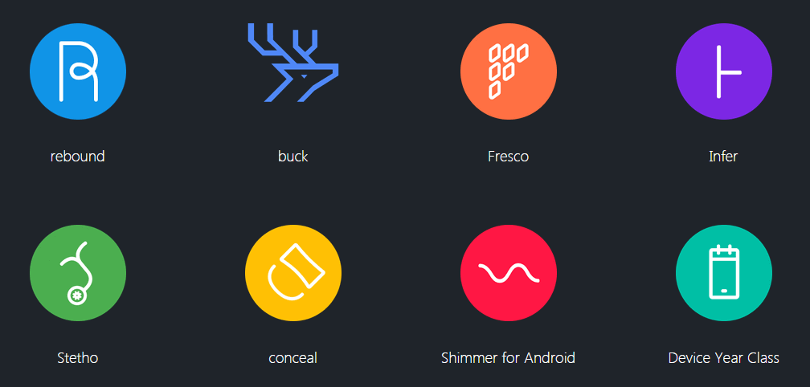

#Android大神
受[Trinea](https://github.com/Trinea)的开源项目的启发和参考，也准备列一列Android圈里的大神们。
介绍一群乐于分享，乐于开源，向往自由的android大神们。还有乐于开源的一些组织。  
> 举一隅，不以三隅反，则不复也。 
> ---------------------------------------------- 论语·述而

通过学习大神，发现更多。  
  

排名不分先后
##ORG
* [Google](#google)
* [Facebook](#facebook)
* [Square](#square)
* [Yalantis](#yalantis)
* [Alibaba](#alibaba)

##COM
* [Jake Wharton](#jake-wharton)
* [Chris Banes](#chris-banes)
* [Mark Murphy](#mark-murphy)
* [Sergey Tarasevich](#sergey-tarasevich)
* [Koushik Dutta](#koushik-dutta)
* [Jeremy Feinstein](#jeremy_feinstein)
* [Simon Vig](#simon-vig)
* [James Smith](#james-smith)
* [Roman Nurik](#roman-nurik)
* [Romain Guy](#romain-guy)
* [ManuelPeinado](#manuelpeinado)
* [Emil Sjölander](#emil-sjölander)
* [Daniel Lew](#daniel-lew)
* [Vladislav Bauer](#vladislav-bauer)

##CN

### [Google](https://github.com/google)
  

google在github上面开源了很多android库应用，尤其是[googleSamples](https://github.com/googlesamples),展示了Android最新的示例。

**masterpiece**:  
* [iosched](https://github.com/google/iosched)
* [ExoPlayer](https://github.com/google/ExoPlayer)  
* [android-topeka](https://github.com/googlesamples/android-topeka)  
...

**contact**:  
   

### [Facebook](https://github.com/facebook)
  

开源上怎么能少Facebook，至于为什么开源-[Facebook开源的真正原因](http://www.infoq.com/cn/news/2015/07/Facebook-LAMP?utm_source=infoq&utm_medium=popular_widget&utm_campaign=popular_content_list&utm_content=homepage)
先看看android上开源项目：  

**masterpiece**:  
* [fresco](https://github.com/facebook/fresco)
* [buck](https://github.com/facebook/buck)
* [Augmented Traffic Control](https://github.com/facebook/augmented-traffic-control)
* [rebound](https://github.com/facebook/rebound)  
* [Bolts-Android](https://github.com/BoltsFramework/Bolts-Android)  
* [conceal](https://github.com/facebook/conceal)  
...

**contact**:  
   

### [Square](https://github.com/square)
  

真的业界良心，开源了很多非常实用的项目。  

**masterpiece**:  
* [okhttp](https://github.com/square/okhttp)
* [retrofit](https://github.com/square/retrofit)
* [dagger](https://github.com/square/dagger)
* [picasso](https://github.com/square/picasso)
* [retrofit](https://github.com/square/retrofit)
* [otto](https://github.com/square/otto)
* [wire](https://github.com/square/wire)
* [spoon](https://github.com/square/spoon)
...  

**contact**:  
   

### [Yalantis](https://github.com/Yalantis)
  

Yalantis提供了很多超级酷炫的动画库。

**masterpiece**:  
* [Context-Menu.Android](https://github.com/Yalantis/Context-Menu.Android)
* [Side-Menu.Android](https://github.com/Yalantis/Side-Menu.Android)
* [Phoenix](https://github.com/Yalantis/Phoenix)
* [Taurus](https://github.com/Yalantis/Taurus)
* [FlipViewPager.Draco](https://github.com/Yalantis/FlipViewPager.Draco)
* [CameraModule](https://github.com/Yalantis/CameraModule)
* [Euclid](https://github.com/Yalantis/Euclid)
* [GuillotineMenu-Android](https://github.com/Yalantis/GuillotineMenu-Android)  
...

**contact**:  
   

### [Alibaba](https://github.com/alibaba)
  

阿里集团的开源，在国内是顶尖的。之所以是集团，是包含了旗下的开源组织，[taobao](https://github.com/taobao),[etao-open-source](https://github.com/etao-open-source)

**masterpiece**:  
* [fastjson](https://github.com/alibaba/fastjson)
* [dexposed](https://github.com/alibaba/dexposed)
* [cube-sdk](https://github.com/etao-open-source/cube-sdk)  
...

**contact**:  

### [Jake Wharton](https://github.com/JakeWharton)
  

就职于Square,Andriod大神(Android开发，必定认识此君).擅长Android版本兼容，[ActionBarSherlock](https://github.com/JakeWharton/ActionBarSherlock),[NineOldAndroids](https://github.com/JakeWharton/NineOldAndroids)都已经被收录到android库中。而且参与了很多其他开源项目，非常活跃。

**masterpiece**:  
* [ActionBarSherlock](https://github.com/JakeWharton/ActionBarSherlock)  
* [NineOldAndroids](https://github.com/JakeWharton/NineOldAndroids) 
* [ViewPagerIndicator](https://github.com/JakeWharton/ViewPagerIndicator) 
* [butterknife](https://github.com/JakeWharton/butterknife) 
* [DiskLruCache](https://github.com/JakeWharton/DiskLruCache) 
* [u2020](https://github.com/JakeWharton/u2020) 
* [RxBinding](https://github.com/JakeWharton/RxBinding) 
* [pidcat](https://github.com/JakeWharton/pidcat) 
...

**contact**:  
   

### [Chris Banes](https://github.com/chrisbanes)
  

目前就职于Google,和Jake Wharton遥相呼应，对开源项目贡献也很多。很多项目都是精品，并且紧跟潮流，[cheesesquare](https://github.com/chrisbanes/cheesesquare)就是Android Design library最新的demo.

**masterpiece**:  
* [Android-PullToRefresh](https://github.com/chrisbanes/Android-PullToRefresh)  
* [ActionBar-PullToRefresh](https://github.com/chrisbanes/ActionBar-PullToRefresh)  
* [PhotoView](https://github.com/chrisbanes/PhotoView)  
* [cheesesquare](https://github.com/chrisbanes/cheesesquare)  
* [philm](https://github.com/chrisbanes/philm)  
* [gradle-mvn-push](https://github.com/chrisbanes/gradle-mvn-push)  
* [photup](https://github.com/chrisbanes/photup)  
...

**contact**:  
   

### [Mark Murphy](https://github.com/commonsguy)

与前两位相比，Mark Murphy则是专注于写了一本[The Busy Coder's Guide to Android Development](https://commonsware.com/Android/),全面介绍了Android.而且在开源项目也贡献很多。

**masterpiece**:  
* [cw-omnibus](https://github.com/commonsguy/cw-omnibus)
* [cw-advandroid](https://github.com/commonsguy/cw-advandroid)  
* [cw-android](https://github.com/commonsguy/cw-android)  
* [cwac-camera](https://github.com/commonsguy/cwac-camera)  
...

**contact**:  
   

### [Sergey Tarasevich](https://github.com/nostra13)

这位大神大家可能不熟悉，不过他的[UIL](https://github.com/nostra13/Android-Universal-Image-Loader)图片缓存和加载框架再熟悉不过了。
目前这个库还是很活跃，一直在进步。

**masterpiece**:  
* [Android-Universal-Image-Loader](https://github.com/nostra13/Android-Universal-Image-Loader)

**contact**:  
   

### [Koushik Dutta](https://github.com/koush)

就职于ClockworkMod，这位大神也有个图片加载框架，还包含了异步网络请求,[ion](https://github.com/koush/ion)。
>另外对https://github.com/CyanogenMod 的开源项目有很多贡献  
>from https://github.com/Trinea/android-open-project

**masterpiece**:  
* [ion](https://github.com/koush/ion)  
* [AndroidAsync](https://github.com/koush/AndroidAsync)  
* [UrlImageViewHelper](https://github.com/koush/UrlImageViewHelper)  
...

**contact**:  
   

### [Jeremy Feinstein](https://github.com/jfeinstein10)

就职于Flatiron Health，最出名的就是他的[SlidingMenu](https://github.com/jfeinstein10/SlidingMenu)。  

**masterpiece**:  
* [SlidingMenu](https://github.com/jfeinstein10/SlidingMenu)  
* [JazzyViewPager](https://github.com/jfeinstein10/JazzyViewPager)  
...

**contact**:  
   

### [Simon Vig](https://github.com/SimonVT)

**masterpiece**:  
* [android-menudrawer](https://github.com/SimonVT/android-menudrawer)
* [MessageBar](https://github.com/SimonVT/MessageBar)
...

**contact**:  
   

### [James Smith](https://github.com/loopj)

就职于Bugsnag，[android-async-http](https://github.com/loopj/android-async-http)这个异步网络框架，是我第一次接触到的网络框架。
> I'm the co-founder of Bugsnag, a popular real-time crash detection service for mobile and web applications, with Simon Maynard. I previously led the product team as CTO of Heyzap, helping scale the company to over 8 million users.  
from http://loopj.com/

**masterpiece**:  
* [android-async-http](https://github.com/loopj/android-async-http)
* [android-smart-image-view](https://github.com/loopj/android-smart-image-view)
...

**contact**:  

### [Roman Nurik](https://github.com/romannurik)

就职于google，其中[muzei](https://github.com/romannurik/muzei)是一款非常棒的Android动态壁纸应用.  
对其他的开源项目贡献也很多，尤其是[iosched](https://github.com/google/iosched)

**masterpiece**:  
* [muzei](https://github.com/romannurik/muzei)
* [AndroidAssetStudio](https://github.com/romannurik/AndroidAssetStudio)
* [Android-SwipeToDismiss](https://github.com/romannurik/Android-SwipeToDismiss)
* [Android-WizardPager](https://github.com/romannurik/Android-WizardPager)  
...

**contact**:  
   

### [Romain Guy](https://github.com/romainguy)

就职于Google，爱好摄影。
> I work at Google on an unannounced project. I previously spent 7 years working as an Android Software Engineer, primarily focusing on anything graphics and animations related.  
from [plus](https://plus.google.com/+RomainGuy)

**masterpiece**:  
* [google-io-2014](https://github.com/romainguy/google-io-2014)
* [ViewServer](https://github.com/romainguy/ViewServer)  
...

**contact**:  
   

### [ManuelPeinado](https://github.com/ManuelPeinado)

**masterpiece**:  
* [FadingActionBar](https://github.com/ManuelPeinado/FadingActionBar)
* [GlassActionBar](https://github.com/ManuelPeinado/GlassActionBar)  
* [MultiChoiceAdapter](https://github.com/ManuelPeinado/MultiChoiceAdapter)  
...

**contact**:  
   

### [Emil Sjölander](https://github.com/emilsjolander)

就职于Flipboard
> I'm Emil , a 20 year old developer and up and comming interaction designer. I focus mostly on mobile design and development but like to try new things!  
from [plus](https://plus.google.com/u/0/+emilsjolander/)

**masterpiece**:  
* [StickyListHeaders](https://github.com/emilsjolander/StickyListHeaders)
* [sprinkles](https://github.com/emilsjolander/sprinkles)  
* [StickyScrollViewItems](https://github.com/emilsjolander/StickyScrollViewItems)  
* [android-FlipView](https://github.com/emilsjolander/android-FlipView)  
* [IntentBuilder](https://github.com/emilsjolander/IntentBuilder)  
...

**contact**:  
   

### [Daniel Lew](https://github.com/dlew)

在Android使用技巧有一个系列文章,[android-tips](http://blog.danlew.net/2014/03/30/android-tips-round-up-part-1/)，比较实用。

**masterpiece**:  
* [joda-time-android](https://github.com/dlew/joda-time-android)
* [android-gridlayout](https://github.com/dlew/android-gridlayout)  
...

**contact**:  

### [Vladislav Bauer](https://github.com/vbauer)

vbauer最著名的就是创建了[android-arsenal](http://android-arsenal.com)网站,收集了各种android库。

**masterpiece**:  
* [android-arsenal.com](https://github.com/vbauer/android-arsenal.com)  
...

**contact**:  

## Reference
*  [Trinea android-open-project](https://github.com/Trinea/android-open-project)
*  [android dev cn](https://github.com/android-cn/android-dev-cn)
*  [android dev com](https://github.com/android-cn/android-dev-com)
*  [Android Dev Bookmarks](https://github.com/zhengxiaopeng/android-dev-bookmarks)
